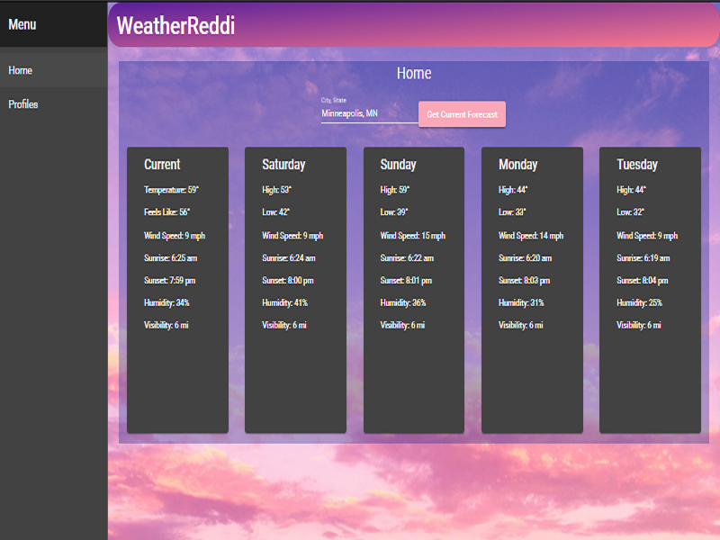

<!-- PROJECT LOGO -->
 

  

  <h3 align="center">WeatherReddi</h3>

<!-- TABLE OF CONTENTS -->

  
<h2 style="display: inline-block">Table of Contents</h2>

  <ol>
    <li>
      <a href="#about-the-project">About The Project</a>
      <ul>
        <li><a href="#built-with">Built With</a></li>
      </ul>
    </li>
    <li><a href="#usage">Usage</a></li>
    <li>
    	<a href="#acknowledgements">Meet The Team</a>
      <ul>
        <li><a href="#built-with">Team Members</a></li>
      </ul>
    </li>
  </ol>

<!-- ABOUT THE PROJECT -->
## About The Project

<!-- Here is where we would add more information regarding the product.-->
The WeatherReddi application, in a broad sense, will pull weather information for the location that a user requests (with the intent being a location the user lives in, can use location services for this). Aside from pulling this information, the user can define inclement weather that they would like to be alerted via text or some notification before or during the time the weather hits, so they can make necessary plans to prepare for it

### Built With

* [NodeJS](https://nodejs.org/en/)
* [Angular CLI](https://angular.io/cli)
* [Angular Material](https://material.angular.io/)

<!-- USAGE EXAMPLES -->
## What Problem Does WeatherReddi Solve?

John lives in a state that frequently has overnight snow in the winter months. This means that unless John checks his weather app every day, there are some mornings John will wake up to snow covering his car and bad road conditions. 

John also has a job where he must commute in the morning hours. Finding his car covered in snow and/or seeing that traffic is backed up will add time to his morning commute which could result in him being late to work.

With WeatherReddi, John can set his weather preferences to alert him of snow in the forecast. WeatherReddi sees that it will snow overnight and then sends him a text 24 hours prior. Now he can plan his routine accordingly.

<!-- Meet The Team -->
## Meet The Team

* Marcus Behr - Group Manager and Developer
* Isiah Taylor - Developer 
* Cody Curtis - Documentation and Database Engineer
* Jacob Gerval - BA, Scrum Master, and Documentation
